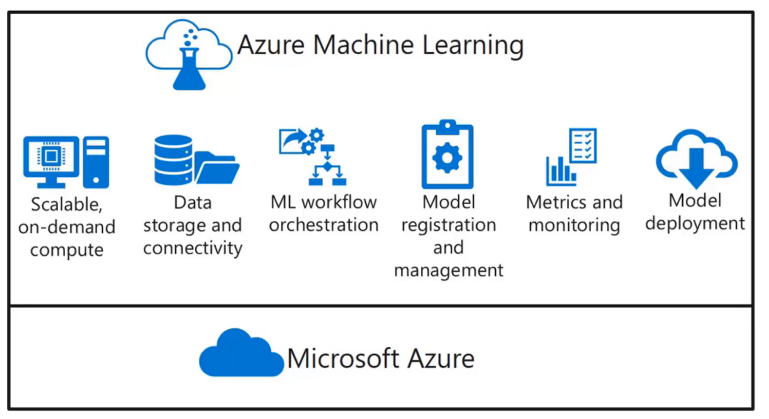
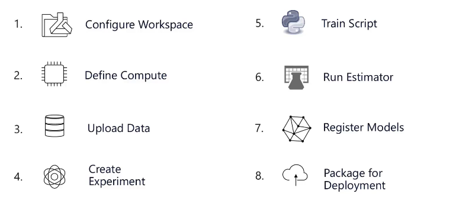
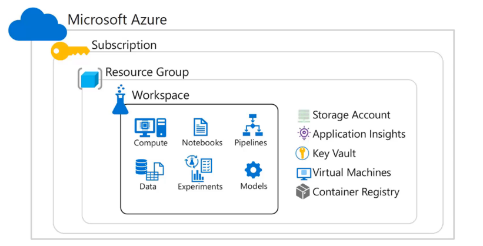
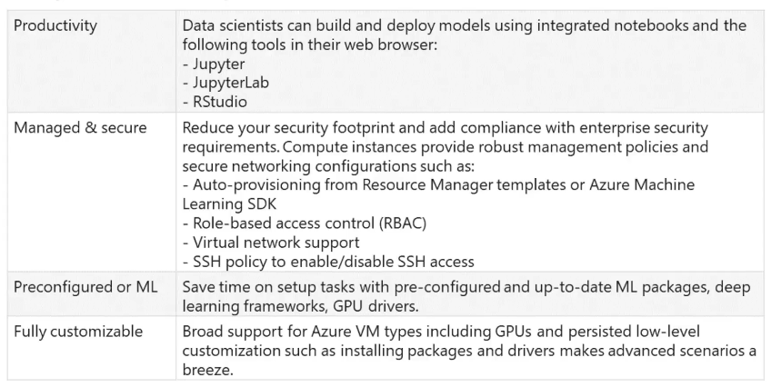
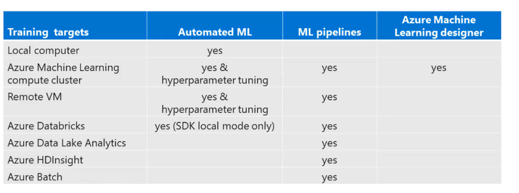

# Set up an Azure Machine Learning

## Intro to Azure Machine Learning

Utilizando os serviços da Azure podemos utilizar Python de 3 formas : 

1. SDK
2. CLI
3. UX

Nos possibilitando 

* Preparar dados
* Criar modelos
* Treinar modelos
* Administrar Modelos
* Realizar Track de experimentos
* Deploy de modelos


```{r fig4, echo=FALSE, fig.cap="Study areas", fig.margin=TRUE}

```

## Workspace

Dentro da **Workspace** temos um ambiente completo para criar projetos de _Machine Learning_, basicamente os 8 steps básicos para criação de projetos é destacado na figura abaixo.

```{r fig5, echo=FALSE, fig.cap="8 basic steps", fig.margin=TRUE}

```


A **Workspace** esta associada a uma subscription e **resource group** que inclui outras funcionalidades de storage, dispositivos para security, VMs e alternativas para administraçãode containers

```{r fig6, echo=FALSE, fig.cap="workspace", fig.margin=TRUE}

```


### Role-Based Access Control

Podemos utilizar RBAC control para administrar a workspace e administrar permissões via Azure Active Directory AAD, por exemplo:

* Podemos criar uma _policy_ que permite IT Operations a riar compute targets e datastores
* Permitir usuários do time de Ciência de Dados a criar, rodar experimentos e registar modelos


### Creating Workspace

A workspace pode ser criada pela interface gráfica _UI_ ou via python SDK. Alguns parametros são obrigratórios como subscription id, resoure group.

```
from azure.core import Workspace

ws = Workspace.create(name = '<name-of-workspace>',
                      subscription_id = '12345...',
                      resource_group = 'aml-resources',
                      create_resource_group=True,
                      location = 'eastus',
                      sku = 'enterprise')
```

* Devemos considerar a região onde iremos criar a workspace pois algumas regiões podem não ter todos os recursos como GPU.


* Outro detalhe é a `sku` que identifica a Edição : **Enterprise** que inclui todas as features ou **Basic** inclui as features core mas não inclui Designer, tools gráficas, automated machine learning ou data drift monitoring.


## Install Azure ML SDK for Python

Para instalar o azure machine learning sdk para python podemos utilizar pip install 

```
pip install azureml-sdk
```

Caso queira incluir modulos extras

```
pip install azureml-sdk[notebooks, automl, explain]
```

## Conectando na Workspace utilizando Python SDK

Uma das opções é baixar o JSON file com as informações de resource group, workspace name e subscription id que esta disponível na interface web e utlizar a função `from_config`.


```
from azureml.core import Workspace

ws = Workspace.from_config()
```

Outra alternativa é utilizar o método `get` : 


```
from azureml.core import Workspace

ws = Workspace.get(name = '<wokspace name>',
                   subscription_id = '<id 12345...>',
                   resource_group = '<resource group name>')
```

Um objeto workspace é o ponto de partida para acessar os recursos na Azure Machine Learning, por exemplo podemos utilizar `ws.compute_targets` para obter informações de máquinas associados a workspace


## Compute Instances

Azure ML inclui a opção de criar **Compute Instances** na workspace para realizar o desenvolvimento e possibilita administrar outros assets na workspace como por exemplo, podemos abrir um Jupyter notebook para criar todo cõdigo.

Azure ML Compute instance ẽ uma workstation para ciÊncia de dados na cloud que pode ser iniciada e parada quando não estiver em uso, e sõ é cobrado quando você estiver utilizando.

Normalmente Compute Instances é utilizado como ambiente de DEV ou pode ser utilizado como um compute target para treinar e realizar inferencias de teste.

Compute instance foi criado para substituir Notebook VM na Azure.


**Porque utilizar compute instances ?**


```{r fig7, echo=FALSE, fig.cap="Porque utilizar Compute Instances", fig.margin=TRUE}

```


## Compute Targets

Na Azure ML compute target são designados como recursos ou ambientes computacionais onde você pode realizar treinamentos via script ou servir como host para service deployment.

Utilizar compute targets oferece a possibilidade de modificar o ambiente sem ter que trocar o código.

Todos os recursos utilizamos para o compute target são anexados a workspace.


Para treinar em compute targets temos diversas opção como descrito abaixo : 

```{r fig8, echo=FALSE, fig.cap="Training a Compute targets", fig.margin=TRUE}

```


