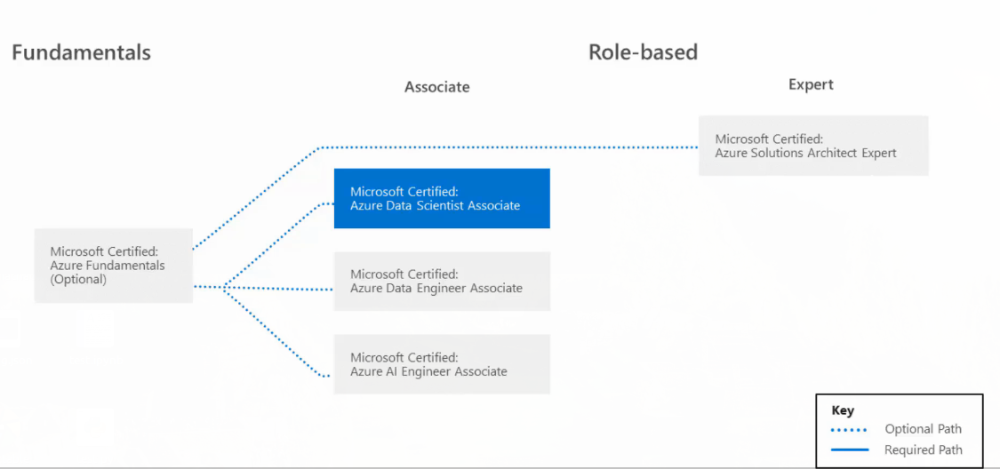
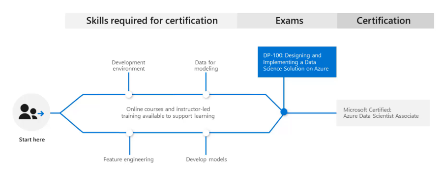
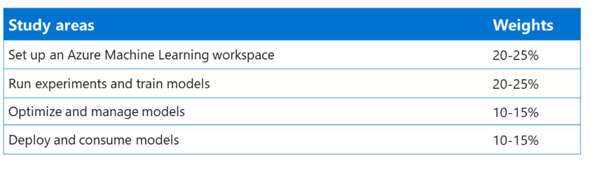

--- 
title: "Estudo DP-100 Design and Implementing a Data Science Solution in Azure"
author: "Bruno de A. Machado"
date: "`r Sys.Date()`"
site: bookdown::bookdown_site
---

# Certification

O estudo para certificação é composto de quatro áreas : 

* Configuração e entender o Azure Machine Learning Workspace
* Saber criar experimentos e treinar modelos
* Otimização e administração de modelos
* Deploy e utilização de modelos


Ao realizar a prova e ser aprovado receberá o tĩtulo de _Microsoft Certified: Azure Data Scientist Associate_. Como pode ser visto na figura abaixo enão tem um pre-req.


```{r fig2, echo=FALSE, fig.cap="Certification path", fig.margin=TRUE}

```


Para iniciar é preciso estudar e ter diversos skills destacados : 

```{r fig3, echo=FALSE, fig.cap="Por onde começar", fig.margin=TRUE}

```


Sobre o teste cada uma dessas áreas tem uma concentração de pesos no exame:

```{r fig1, echo=FALSE, fig.cap="Study areas", fig.margin=TRUE}

```


Neste documento anoto detalhes sobre meu estudo.


